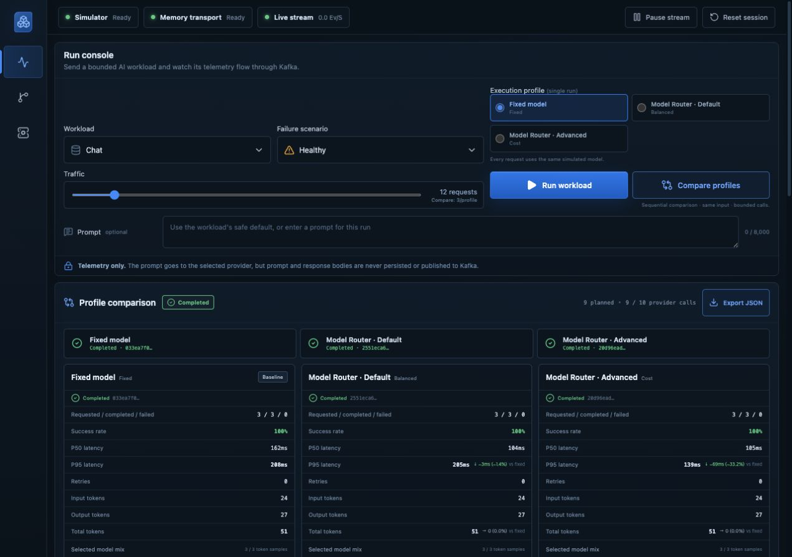
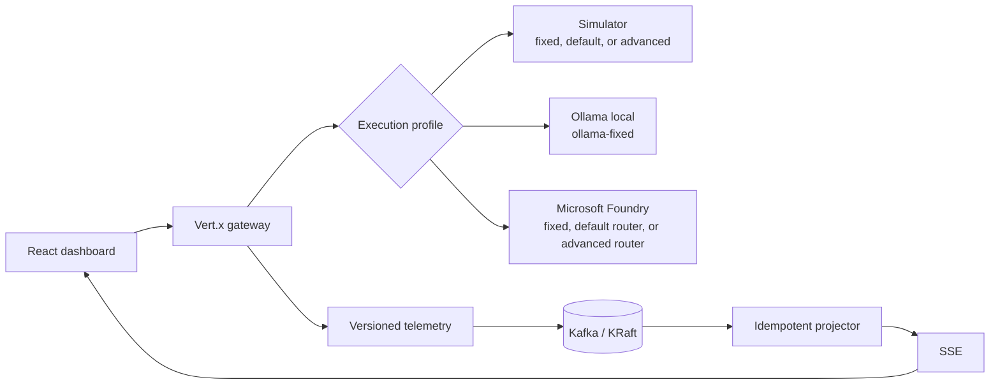

# Foundry Stream Lab

[](https://github.com/hyeonsangjeon/foundry-stream-lab/actions/workflows/ci.yml)
[](https://github.com/hyeonsangjeon/foundry-stream-lab/releases/latest)
[](LICENSE)

**A local-first lab for separating AI model-routing latency from Kafka delivery
failures.**

Replay one unchanged workload across **Fixed → Default/Balanced →
Advanced/Cost or Quality** profiles. Inject model throttling, consumer slowdown,
duplicate delivery, or a hot partition, then compare p50/p95 latency, retries,
tokens, model mix, Kafka lag, and partition skew in a privacy-safe live
dashboard.

- **Zero-cloud default:** deterministic simulator, Kafka KRaft, and the React
  dashboard through Docker Compose.
- **Local model:** Ollama through its OpenAI-compatible Responses API as a
  fixed-model profile.
- **Real routing:** Microsoft Foundry fixed and Model Router deployments, with
  evaluation, managed tracing, and sanitized evidence tooling.

[Try it locally](#quick-start) ·
[See a real Foundry Compare Run](docs/evidence/2026-07-17-foundry-compare/README.md) ·
[Follow the demo runbook](docs/demo-runbook.md)



## Why this exists

AI failures and streaming failures often look similar from a distance. This lab
makes the boundary visible:

- model throttling raises retry count and AI tail latency;
- consumer slowdown raises Kafka lag and telemetry freshness;
- duplicate delivery increases raw records without double-counting outcomes;
- a hot partition creates skew without inventing request failures.

The default simulator is deterministic, credential-free, and includes
`fixed`, `router-default`, and `router-advanced` profiles. Ollama provides a local fixed-model
path. Microsoft Foundry adds a real fixed deployment, a default Balanced router,
and a separately configured advanced router through the Responses API and
`DefaultAzureCredential`.

**Compare profiles** replays one unchanged input across the available profiles
as a single sequential, bounded execution. It reports outcomes, p50/p95,
retries, tokens, model mix, and fixed-baseline deltas without retaining prompt
or response bodies. See [the Compare Run manual](docs/comparison.md).

## Quick start

Prerequisites: Docker with Compose support. Then run:

```bash
docker compose up --build
```

Open [http://127.0.0.1:8080](http://127.0.0.1:8080). The complete simulated lab
starts with Kafka 4 in KRaft mode, creates the telemetry topics, and serves the
React dashboard from the Vert.x application.

No Azure credentials are read in the default configuration.

### Released container

Stable releases are published for both `linux/amd64` and `linux/arm64` with an
SBOM and provenance attestation:

```bash
docker pull ghcr.io/hyeonsangjeon/foundry-stream-lab:1.3.0
docker run --rm -p 127.0.0.1:8080:8080 \
  ghcr.io/hyeonsangjeon/foundry-stream-lab:1.3.0
```

The standalone image uses the deterministic simulator and in-memory telemetry
transport by default. Use the Compose quick start for the complete Kafka path.

### Suggested demo

1. Keep the workload, prompt, and **Healthy** scenario unchanged.
2. Set traffic per profile within the server-provided comparison limit.
3. Select **Compare profiles** to run Fixed → Default → Advanced sequentially.
4. Review p95 latency, outcomes, retries, token totals, and model mix against
   the fixed baseline. Simulator routing is explicitly synthetic; Foundry
   routing modes belong to separate Azure deployments.
5. Add **Consumer slowdown** to separate Kafka lag from model latency, then add
   **Model throttling** to inspect the bounded retry in trace details.

See [the scenario guide](docs/scenarios.md) for a presenter-ready script.

## Verified live evidence

The [v1.2.0 Foundry Compare Run bundle](docs/evidence/2026-07-17-foundry-compare/README.md)
preserves a real fixed/default/advanced run, responsive screenshots, allowlisted
API input/output, curated model responses, local and managed evaluation charts,
content-redacted tracing, Azure Monitor usage, release provenance, checksums,
and the verified resource deletion/purge record. It uses only synthetic prompts
and normalizes cloud resource names and locator IDs.

The earlier [single-profile live capture](docs/evidence/2026-07-16-foundry-live/README.md)
remains available as historical evidence.

## Architecture



The request path and telemetry path are deliberately separate. A slow telemetry
consumer does not slow the provider call, and a throttled provider does not
fabricate Kafka lag. See [the architecture notes](docs/architecture.md) for the
component and failure boundaries.

## Provider modes

| Provider | Credentials | Available profiles | Network boundary |
| --- | --- | --- | --- |
| `simulated` (default) | None | `fixed`, `router-default`, `router-advanced` | No provider network call |
| `ollama` | None | `ollama-fixed` | Loopback OpenAI-compatible `/v1/responses` |
| `foundry` | Microsoft Entra | `fixed`, `router-default`, `router-advanced` when configured | Foundry project endpoint |

There is no automatic Ollama-to-Foundry fallback. Selecting `ollama` either
uses the configured local endpoint or fails visibly; it never turns a local run
into a paid cloud request.

### Ollama local mode

Run Ollama and choose a model already pulled on your machine. Start Kafka with
Compose, then run the gateway on the host so the loopback-only default remains
meaningful:

```bash
make kafka

cd app
mvn -B package

AI_PROVIDER=ollama \
EVENT_TRANSPORT=kafka \
KAFKA_BOOTSTRAP_SERVERS=localhost:9092 \
OLLAMA_BASE_URL='http://127.0.0.1:11434/v1' \
OLLAMA_MODEL='YOUR-LOCAL-MODEL' \
OLLAMA_REQUIRE_LOOPBACK=true \
java -jar target/foundry-stream-lab.jar
```

In a second terminal, serve the dashboard and open
[http://127.0.0.1:5173](http://127.0.0.1:5173):

```bash
cd web
npm ci
npm run dev
```

The Ollama adapter uses the official OpenAI-compatible `/v1/responses`
surface. It is a fixed-model path; Compare Run is unavailable rather than
inventing router results.

### Microsoft Foundry fixed vs Model Router

Use a dedicated non-production Foundry project with a fixed deployment and a
separate Model Router deployment. Start Kafka, then run the application on the
host so `DefaultAzureCredential` can use your Azure CLI session:

```bash
az login
make kafka

cd app
mvn -B package

AI_PROVIDER=foundry \
EVENT_TRANSPORT=kafka \
KAFKA_BOOTSTRAP_SERVERS=localhost:9092 \
FOUNDRY_PROJECT_ENDPOINT='https://YOUR-RESOURCE.services.ai.azure.com/api/projects/YOUR-PROJECT' \
FOUNDRY_MODEL='YOUR-FIXED-DEPLOYMENT' \
FOUNDRY_ROUTER_DEFAULT_MODEL='YOUR-DEFAULT-BALANCED-ROUTER' \
FOUNDRY_ROUTER_ADVANCED_MODEL='YOUR-ADVANCED-ROUTER' \
FOUNDRY_ROUTER_ADVANCED_PROFILE='cost' \
MAX_CLOUD_REQUESTS_PER_RUN=10 \
java -jar target/foundry-stream-lab.jar
```

In a second terminal:

```bash
cd web
npm ci
npm run dev
```

Open [http://127.0.0.1:5173](http://127.0.0.1:5173). The development server
proxies `/api` to the Java gateway. More setup and managed-identity guidance is
in [docs/foundry.md](docs/foundry.md).

`FOUNDRY_ROUTER_ADVANCED_PROFILE` is display/validation metadata. Configure
Balanced, Cost, or Quality behavior on each Model Router deployment in Foundry
or infrastructure-as-code; changing an environment value does not reconfigure
the deployment per request. The legacy `FOUNDRY_ROUTER_MODEL` and
`FOUNDRY_ROUTER_PROFILE` pair remains supported for existing single-router
setups.

The repository includes repeatable Azure provisioning under `infra/`, a pinned
wrapper around Microsoft's Model Router Auto Evaluation toolkit under
`tools/eval/`, and a content-redacted managed tracing smoke test under
`tools/foundry/`. See [the Foundry guide](docs/foundry.md) for the complete live
workflow and the boundaries of the recorded verification; the aggregate benchmark
is recorded in [the live evaluation note](docs/live-evaluation.md), with its
sanitized artifacts in the [Compare Run evidence bundle](docs/evidence/2026-07-17-foundry-compare/README.md).

## Privacy boundary

Prompts are sent only to the selected provider. Prompt and response bodies are
never published to Kafka, retained by the projection, or stored in the browser.
Foundry requests set `store(false)`.

Telemetry contains only opaque IDs, workload/scenario aliases, SHA-256 digests,
character counts, timing, attempts, safe error codes, privacy-safe model-family
and route labels, and delivery observations. It excludes credentials, prompts,
responses, project endpoints, raw deployment names, tenants, and subscriptions.
The contract is machine-readable at
[docs/contracts/telemetry-event-v1.schema.json](docs/contracts/telemetry-event-v1.schema.json).

## Development

For local CI parity, use Java 21, Maven 3.8+, and Node.js 24. Foundry mode also
requires the Azure CLI; the Docker quick start does not.

```bash
make test          # Java tests, frontend lint/tests/build
make backend-test  # Maven verify
make web-test      # ESLint, Vitest, Vite production build
make repository-traffic-test  # Offline GitHub traffic attribution tests
make build         # Production container image
```

For credential-free host development, start the backend with
`AI_PROVIDER=simulated EVENT_TRANSPORT=memory`, then start Vite in `web/`.
`AI_MODE` remains a compatibility alias only when `AI_PROVIDER` is absent.

### Project layout

```text
app/                 Java 21 / Vert.x API, providers, transport, projection
web/                 React / TypeScript dashboard
docs/                Architecture, scenarios, Foundry setup, event contract
tools/               Evaluation, evidence, Foundry, and repository utilities
compose.yaml         Kafka KRaft broker, topics, and application
Dockerfile           Reproducible multi-stage production image
.github/workflows/   Backend, frontend, and container CI
```

### HTTP surface

| Method | Path | Purpose |
| --- | --- | --- |
| `GET` | `/api/v1/health` | Readiness and active provider/transport |
| `GET` | `/api/v1/config` | Safe dashboard configuration |
| `GET` | `/api/v1/snapshot` | Current bounded projection |
| `GET` | `/api/v1/stream` | One-way Server-Sent Events stream |
| `POST` | `/api/v1/runs` | Start one bounded workload |
| `POST` | `/api/v1/runs/{id}/stop` | Stop the active workload |
| `POST` | `/api/v1/comparisons` | Start one bounded sequential profile comparison |
| `GET` | `/api/v1/comparisons/{id}` | Fetch the privacy-safe comparison export |
| `POST` | `/api/v1/comparisons/{id}/stop` | Stop remaining phases and retries |
| `DELETE` | `/api/v1/session` | Clear ephemeral session state |

## Scope

The included broker is ephemeral, unauthenticated, and loopback-bound. This is
a local reliability lab, not a production Kafka, identity, or multi-tenant
deployment template. Production boundaries are documented in
[SECURITY.md](SECURITY.md).

## Project history

Foundry Stream Lab is a complete 2026 rebuild of the original Kafka metrics
demo. It keeps the useful `event -> Kafka -> projection -> live dashboard`
idea while replacing the legacy Java/runtime path and vendored admin theme with
a focused Microsoft Foundry routing, evaluation, and observability lab. See
[the migration and provenance note](docs/migration.md).

The rename also means GitHub's rolling traffic window can contain both the old
and canonical repository paths. The
[repository traffic attribution guide](docs/repository-traffic.md) defines the
separate metrics and the repeatable capture workflow; legacy-path views are not
treated as new-name content interest.

## License and provenance

The current rewritten source tree is licensed under the [MIT License](LICENSE).
[NOTICE](NOTICE) preserves the original Vert.x example lineage, and
[third-party notices](THIRD_PARTY_NOTICES.md) cover distributed dependencies.
Historical revisions and releases through `v1.2.0` remain under the license
that accompanied them; the canonical Apache-2.0 text is retained under
[`LICENSES`](LICENSES/Apache-2.0.txt).
