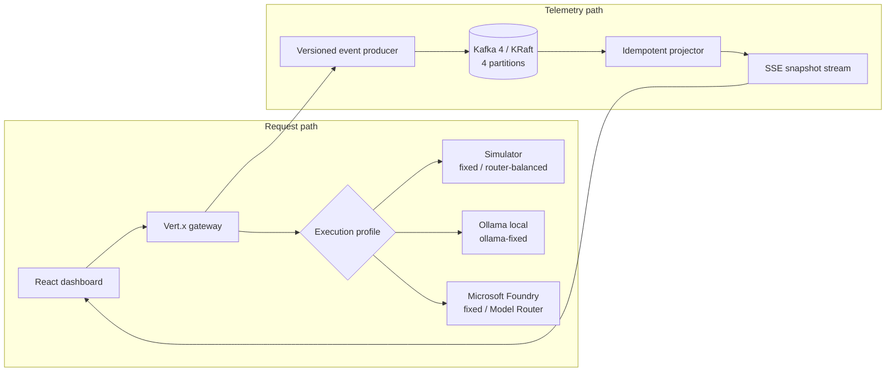

# Architecture

Foundry Stream Lab deliberately separates the AI request path from the
telemetry delivery path. A slow consumer must not be misdiagnosed as a slow
model, and a throttled model must not be disguised as Kafka lag.

## Components

### Vert.x gateway

Accepts bounded workload runs, applies one deterministic failure scenario, and
emits lifecycle events. Blocking Foundry calls execute away from the Vert.x
event loop. The HTTP surface is versioned under `/api/v1`.

### AI providers

- `simulated` is the default. It makes no network calls and produces seeded,
  repeatable latency, token, retry, outcome, and route-decision data. Its
  `fixed` and `router-balanced` profiles make the comparison available without
  credentials; every simulated signal is labelled synthetic.
- `ollama` calls a local OpenAI-compatible `/v1/responses` endpoint. It exposes
  only `ollama-fixed`, requires an explicit local model, and rejects a
  non-loopback base URL by default.
- `foundry` uses the Microsoft Foundry project endpoint, Responses API, and
  `DefaultAzureCredential`. It always exposes `fixed`; `router-balanced` is
  added when `FOUNDRY_ROUTER_MODEL` is configured. Cloud runs are capped by
  `MAX_CLOUD_REQUESTS_PER_RUN`.

Provider selection and execution-profile selection are separate. The API
publishes both `models` and `modelProfiles`; a run accepts `modelId` or
`modelProfile` and rejects unknown or contradictory values. Profile IDs are
`fixed`, `router-balanced`, and `ollama-fixed`.

There is no automatic provider fallback. In particular, an unavailable Ollama
endpoint produces a visible local-provider failure instead of sending the
request to Foundry.

For a real Foundry Model Router run, the application selects the router
deployment but does not choose its underlying model. Balanced, Cost, or Quality
mode is configured on that deployment. `FOUNDRY_ROUTER_PROFILE` only labels and
validates the deployment intent for this demo; it is not a per-request routing
control.

The provider response is ephemeral. It is not published to Kafka or retained by
the dashboard.

### Event transport

- `kafka` uses the real four-partition topic in `compose.yaml`.
- `memory` implements the same interface for unit tests and credential-free
  host development.

The local Kafka broker is intentionally ephemeral and loopback-bound. It is a
reliability lab, not a production deployment template.

### Projector

The projector validates the versioned envelope, deduplicates by `event_id`,
attaches delivery observations (partition, offset, consumed time), and builds a
bounded in-memory view for the UI. Kafka delivery metadata is never forged by
the producer.

### Dashboard

The React dashboard obtains an initial snapshot over HTTP and incremental
snapshots over Server-Sent Events. SSE replaces the legacy unauthenticated
SockJS event-bus bridge because the browser only needs a one-way stream.

## Data boundary

Kafka events may contain:

- opaque run, trace, request, and event IDs;
- workload, provider, profile, and route **aliases**;
- privacy-safe model-family labels selected from a hardcoded mapping;
- prompt length and SHA-256 digest;
- character and token counts, latency, attempt number, outcome, and injected
  scenario.

Kafka events and browser storage must not contain:

- raw prompts or model responses;
- Ollama or Foundry endpoints, raw model IDs, or deployment names;
- access tokens, tenant IDs, subscription IDs, or customer identifiers.

The telemetry detail keys for model routing are `model_profile`,
`route_strategy`, `selected_route`, and `model_family`. The projector exposes
camelCase equivalents to the browser. Values are bounded safe labels; no raw
provider response field is passed through.

## Failure semantics

| Scenario | Injection point | Expected signal |
| --- | --- | --- |
| Healthy baseline | None | Balanced partitions and low freshness |
| Model throttling | Provider | Retries and higher AI tail latency; stable Kafka lag |
| Consumer slowdown | Projector | Higher lag and freshness; stable AI success/latency |
| Duplicate delivery | Producer | More raw records; unchanged logical completion count |
| Hot partition | Record key | Partition skew; no fabricated request failure |

Only one scenario is active per run, which keeps comparisons explainable and
tests deterministic.

## Production boundaries

The demo omits authentication, multi-tenancy, durable projections, Kafka
TLS/SASL, long-term tracing storage, and automatic remediation. Add those at an
infrastructure boundary rather than weakening the local lab's safe defaults.
