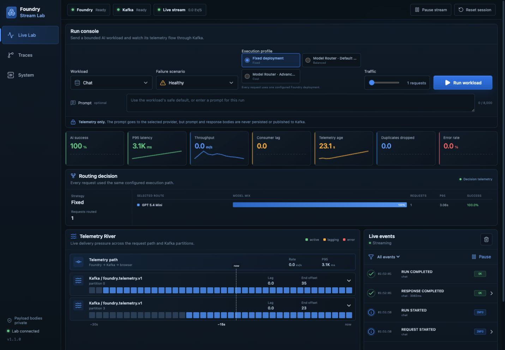
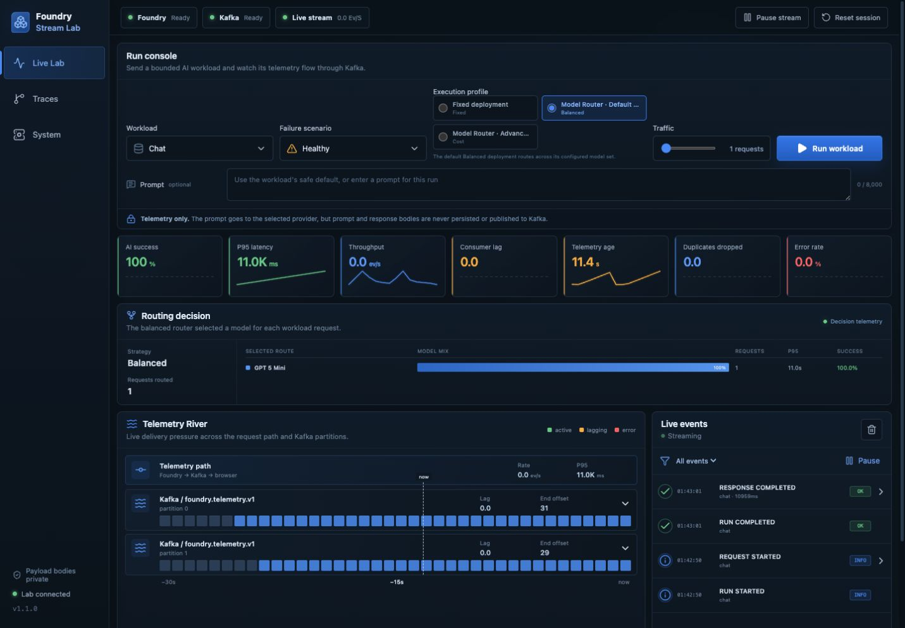
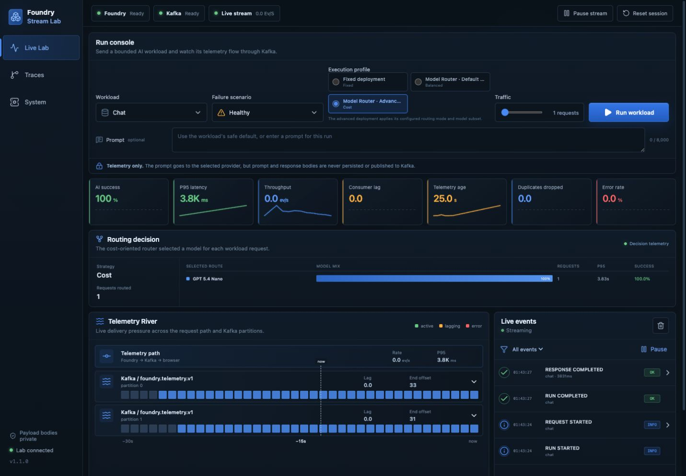
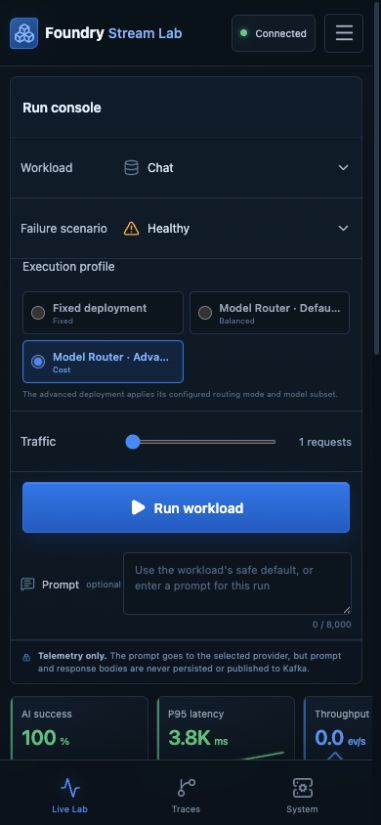
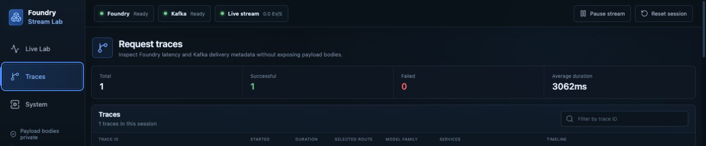
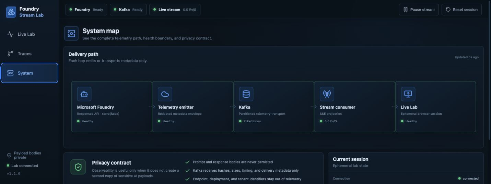
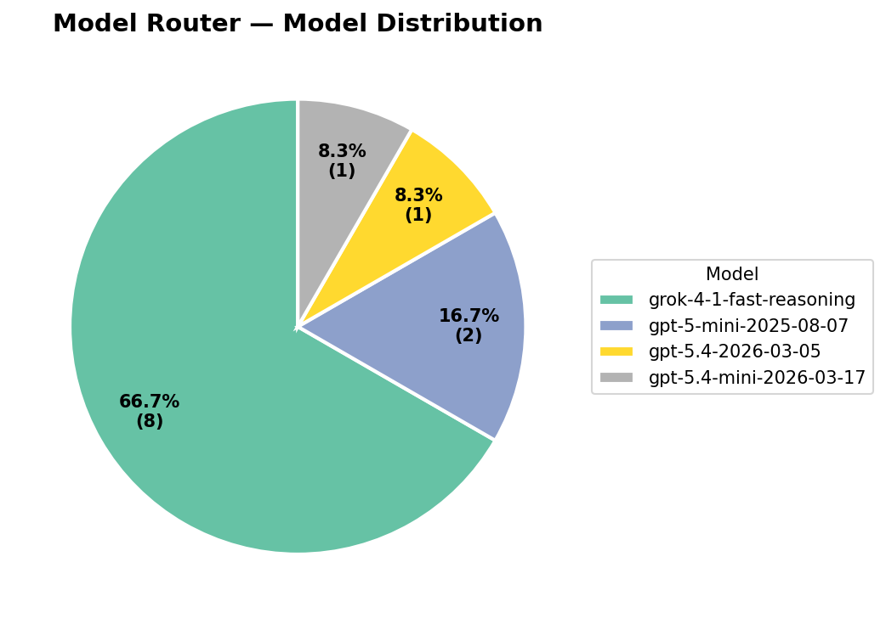
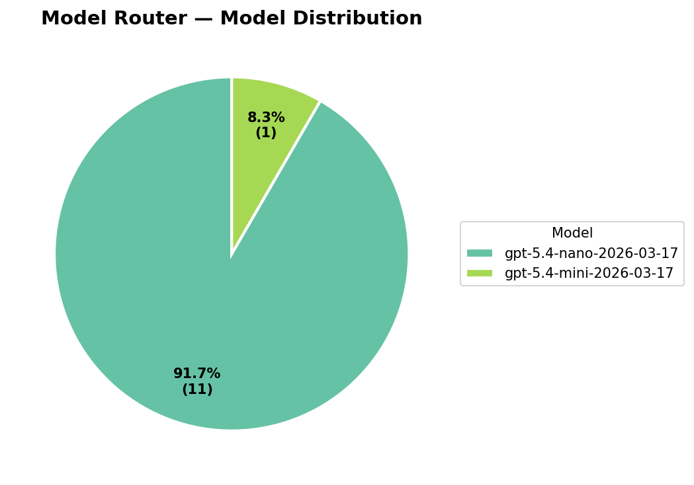
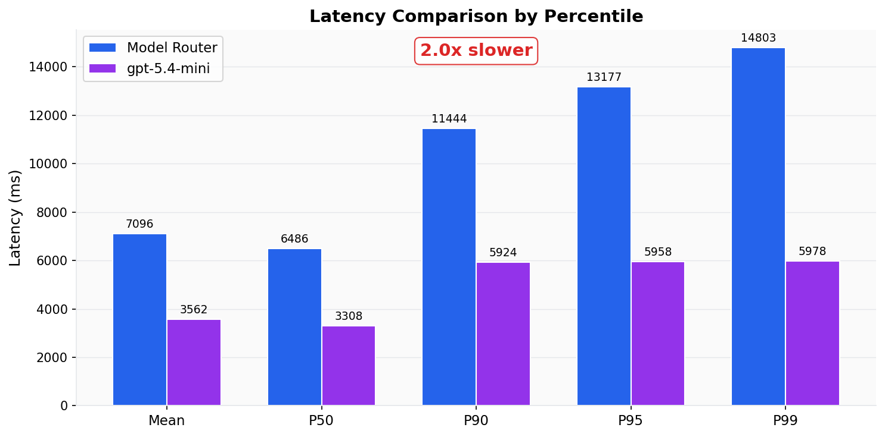
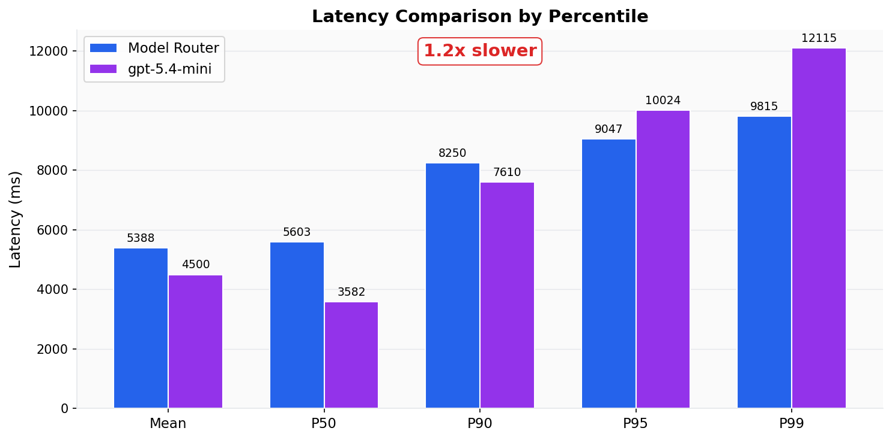

# Foundry live demo evidence — 2026-07-16 UTC

This directory freezes the useful, public parts of the live Microsoft Foundry
demo before its dedicated Azure resources are released. It covers the three
execution profiles, Kafka telemetry, evaluation, managed tracing, Azure Monitor
usage, infrastructure settings, screenshots, and cleanup verification.

The source was release `v1.1.0` at commit
`99cc14ca05e3e9a5d049d4bf080b3a3d4b732cc7`, running on an Apple M1 host with
Microsoft Entra authentication and Foundry local auth disabled.

## Live dashboard observation

The same built-in `chat` / `healthy` input was sent once through each profile.

| Profile | Strategy | Selected model | Latency | Tokens in/out | Result |
| --- | --- | --- | ---: | ---: | --- |
| Fixed | Fixed | GPT-5.4 mini | 3,062 ms | 22 / 115 | Completed |
| Default router | Balanced | GPT-5 mini | 10,959 ms | 28 / 1,209 | Completed |
| Advanced router | Cost | GPT-5.4 nano | 3,831 ms | 28 / 78 | Completed |

These one-request observations prove routing and telemetry integration only.
The complete sanitized, response-body-free export is in
[live-dashboard-summary.json](data/live-dashboard-summary.json).

### Screenshots

| Fixed | Default Balanced | Advanced Cost |
| --- | --- | --- |
|  |  |  |

| Advanced mobile | Trace summary | Privacy system map |
| --- | --- | --- |
|  |  |  |

The trace screenshot is intentionally cropped before the trace rows, preserving
the success and latency summary without any trace handle.

## Evaluation evidence

The 12-prompt synthetic matrix completed without router, baseline, or judge
request errors. The default router selected four model families; the advanced
Cost deployment selected GPT-5.4 nano for 11 of 12 prompts. The fixed mini
baseline won more judged pairs in this small dataset. Cost remains `N/A` because
the pinned toolkit could not verify prices for every route.

| Default model distribution | Advanced model distribution |
| --- | --- |
|  |  |

| Default latency | Advanced latency |
| --- | --- |
|  |  |

All 12 charts are retained under `charts/default/` and `charts/advanced/`. The
sanitized local and managed grader aggregates are in
[evaluation-summary.json](data/evaluation-summary.json), and one manually
reviewed synthetic input/output triplet is in
[curated-model-io.md](examples/curated-model-io.md).

## Inventory, tracing, usage, and cleanup

- [Infrastructure inventory](data/infrastructure-summary.json) records resource
  types, names, deployment models/versions, routing policy, capacity, retention,
  and the 41 passing verification checks.
- [Tracing summary](data/tracing-summary.json) records three successful smoke
  operations and proves that captured message structures contained roles/types,
  not prompt or response text.
- [Usage summary](data/usage-summary.json) preserves the two-day Azure Monitor
  request/token series. It explicitly does not interpret them as user request
  counts. Cost Management returned no rows at capture time, which means billing
  data was not yet available—not that cost was zero.
- [Cleanup summary](data/cleanup-summary.json) is the current deletion gate and
  becomes the authoritative purge record after its post-cleanup verification is
  filled in. Provider registrations are subscription-scoped and intentionally
  retained.

Use [the demo runbook](../../demo-runbook.md) to reproduce the flow and
[the API examples](../../api-examples.md) for the request, response, SSE, and
validation contracts.

## Data boundary

Committed here:

- manually reviewed screenshots with no cloud account UI;
- aggregate infrastructure, evaluation, tracing, and usage data;
- evaluation charts that contain no endpoint or account locator;
- one synthetic model I/O example; and
- SHA-256 checksums for the evidence files.

Deliberately excluded:

- access tokens, keys, connection strings, and Azure CLI account context;
- subscription, tenant, principal, role-assignment, resource, full trace,
  request, evaluation, run, and portal locator IDs;
- raw Application Insights property bags; and
- bulk model responses, Foundry evaluation inputs, detailed raw records, and
  local absolute paths.

The disposable demo resource, project, workspace, Application Insights, and
deployment **names** are intentionally retained so the inventory and cleanup
record can be audited. Endpoint URLs and Azure resource/subscription/tenant/
principal IDs are not retained. Local auth was disabled. The environment will
be removed only after this evidence is published; the live gate and eventual
deletion result are recorded in [cleanup-summary.json](data/cleanup-summary.json).

See [manifest.json](manifest.json) for provenance and `checksums.sha256` for
artifact integrity.
