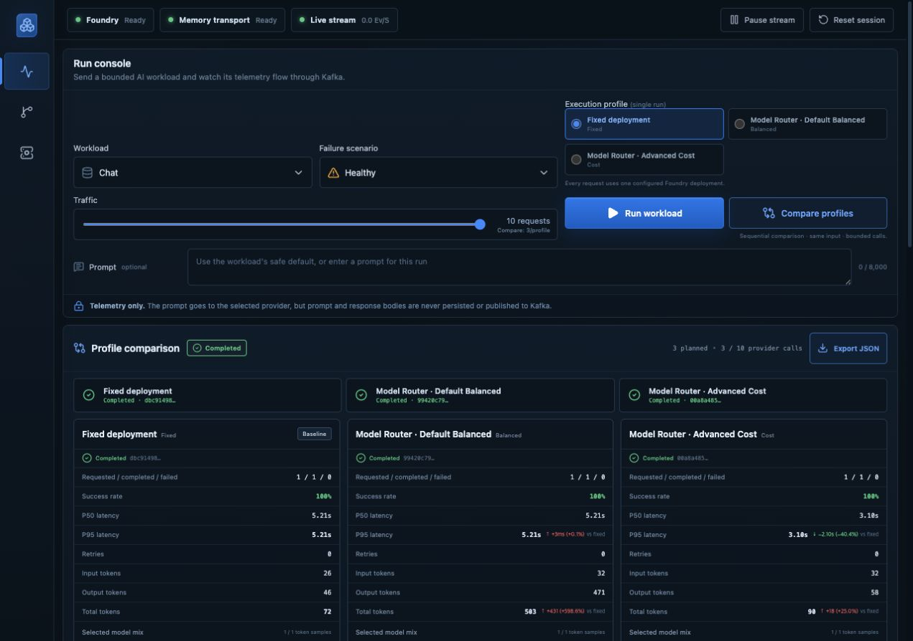
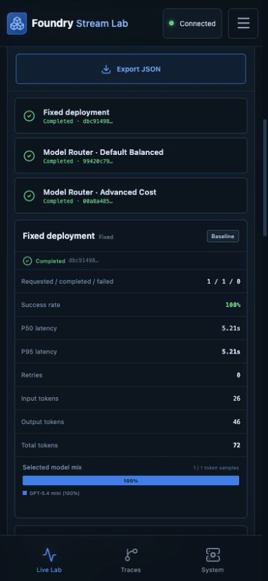
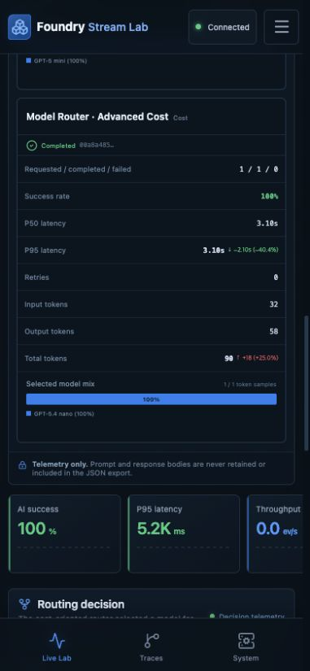

# Foundry v1.2.0 Compare Run evidence — 2026-07-17 UTC

This directory freezes the useful public evidence from a disposable Microsoft
Foundry environment before deletion. It covers the released three-profile
Compare Run, browser screenshots, exact allowlisted API input/output,
independently curated model responses, local and managed evaluation, managed
tracing, Azure Monitor usage, infrastructure settings, and release provenance.

The source is release `v1.2.0` at commit
`6950b5265a6f58de6a0a52897505989a3d7fe1e3`, with immutable container digest
`sha256:671aac617933abbc35d3bc06b0ab695f83bf6d9e4090217e4a630cf19c068789`.
The image has public `linux/amd64` and `linux/arm64` manifests; each has SPDX
SBOM and SLSA provenance attestations. The live application ran on an Apple M1
host using Microsoft Entra authentication with Foundry local auth disabled.

## Live Compare Run

One public input was replayed strictly in the order Fixed → Default Balanced →
Advanced Cost, with one request per profile and a ten-call total provider cap.

| Profile | Selected model | P95 | Tokens in/out | Result | Fixed delta |
| --- | --- | ---: | ---: | --- | --- |
| Fixed | GPT-5.4 mini | 5,207 ms | 26 / 46 | 1/1, 0 failed | baseline |
| Default Balanced | GPT-5 mini | 5,210 ms | 32 / 471 | 1/1, 0 failed | +3 ms (+0.1%) |
| Advanced Cost | GPT-5.4 nano | 3,105 ms | 32 / 58 | 1/1, 0 failed | −2,102 ms (−40.4%) |

These are single observations proving integration and telemetry, not a general
performance claim. The exact normalized export is
[`comparison-result.json`](data/application/comparison-result.json), and the
reproducible request/receipt are explained in
[`comparison-api-io.md`](examples/comparison-api-io.md).

### Screenshots

| Desktop comparison | Mobile comparison | Advanced Cost mobile |
| --- | --- | --- |
|  |  |  |

## Input/output and evaluation

[`curated-model-io.md`](examples/curated-model-io.md) retains one manually
reviewed synthetic response from each configured deployment. The application
does not retain these bodies; they were collected separately and raw bulk data
remains ignored.

The pinned evaluation tool ran one longer synthetic runbook prompt against each
router and the same fixed baseline, then submitted both records to Foundry
managed Evaluation. Both managed jobs completed without grader errors, but the
single records failed at least one configured quality/pairwise/latency
criterion. In particular, the Cost-routed nano model consumed its 1,024-token
completion budget on the longer prompt without visible answer text and received
a 1/5 quality score. A separate shorter prompt returned a visible nano answer.
This is a useful failure observation and why one-item demos must not be treated
as routing policy benchmarks. See
[`evaluation-summary.json`](data/evaluation-summary.json) and the ten charts in
[`charts`](charts/).

## Tracing, usage, and infrastructure

- [`tracing-summary.json`](data/tracing-summary.json) records three successful
  instrumented smoke operations and six successful dependency spans. Known
  prompt/response phrases matched zero property bags; only role/part shapes are
  retained.
- [`usage-summary.json`](data/usage-summary.json) records the one-hour Azure
  Monitor request/token snapshot. It includes application, evaluation, judge,
  tracing, retry, and router-accounting activity and is not an end-user request
  count. Cost Management had no row yet; that is billing delay, not zero cost.
- [`infrastructure-summary.json`](data/infrastructure-summary.json) records the
  dedicated account/project, fixed deployment, default Balanced/all-model
  router, Cost/three-model router, monitoring resources, and 41/41 passing
  verification checks.
- [`release-summary.json`](data/release-summary.json) records the immutable
  release digest, platform manifests, SBOM, and provenance verification.

## Data boundary

Committed here:

- public/synthetic application input and an explicit allowlist result;
- manually reviewed response examples and aggregate evaluation records;
- screenshots with no cloud account UI or full trace handles;
- aggregate tracing, usage, infrastructure, and release data; and
- SHA-256 checksums for every evidence file except the checksum file itself.

Deliberately excluded:

- access tokens, keys, connection strings, and Azure CLI account context;
- subscription, tenant, principal, role-assignment, resource, full trace,
  request, response, evaluation, run, and portal locator IDs; Azure resource
  names are normalized;
- endpoint URLs, raw Application Insights property bags, and raw snapshots;
- bulk evaluation inputs/results and unreviewed provider responses; and
- local absolute paths.

The screenshots retain only shortened, non-resolvable application child-run
fragments shown by the product UI; no full application or cloud run handle is
present. This pre-deletion bundle must be merged to the default branch before
cleanup. After the dedicated resource group is deleted and the Foundry account
is purged, a separate cleanup record will update this README, manifest, and
checksums.

See [`manifest.json`](manifest.json) for provenance and `checksums.sha256` for
artifact integrity.
